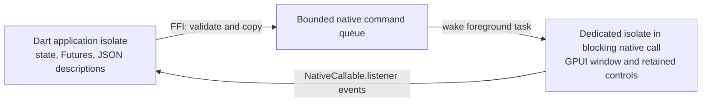

# Integration decision

Source inspected on 2026-09-25 at GPUI Kit commit `21622a70efd25219d26aa459164878c4da9e39f8`.

## Reuse findings

| Part | Source finding | Decision for this spike |
| --- | --- | --- |
| Base and Component | Kit exposes native controls and retained input/table entities. | Use Kit directly for the four initial controls. |
| Shell engine | `ShellRuntime` and view handles re-export QuickJS types. | Treat Dart as a port that needs a new contract. |
| Shell snapshot | Its constructor is crate-private and stores a weak `ShellRuntime` for callback lifetime management. | Do not assume an external Dart package can construct one. |
| Shell materializer | Public `materialize` takes `Rc<ShellRuntime>` and `RenderSnapshot`. | Reusing it requires changing the host/runtime boundary. |
| Styled catalog | `gpui-component-shell` registers styled components through a frozen registry. | This is an existing catalog adapter to study during a Shell port. |
| Repaint path | Shell caches snapshots and can reuse GPUI subtrees. Virtual lists and dock chrome have frame-path callbacks. | Measure view renders, frame callbacks and materialization separately. |

The earlier statement that styled components are not automatically included in Shell remains true, but the pinned source already contains an explicit adapter for them. It is no longer necessary to assume every Shell component binding must be authored from scratch.

Source links:

- [Engine boundary](https://github.com/longbridge/gpui-kit/blob/21622a70efd25219d26aa459164878c4da9e39f8/crates/shell/src/engine/mod.rs)
- [Snapshot ownership](https://github.com/longbridge/gpui-kit/blob/21622a70efd25219d26aa459164878c4da9e39f8/crates/shell/src/snapshot.rs)
- [Materializer](https://github.com/longbridge/gpui-kit/blob/21622a70efd25219d26aa459164878c4da9e39f8/crates/shell/src/materialize.rs)
- [Styled component registry](https://github.com/longbridge/gpui-kit/blob/21622a70efd25219d26aa459164878c4da9e39f8/crates/component-shell/src/lib.rs)

## Implemented boundary

GPUI runs on the thread that enters `gd_run`. The Dart worker isolate stays in that native call until the window closes. The application isolate continues processing its normal event loop. Commands wake a GPUI foreground task through an asynchronous channel; there is no frame polling or Dart render callback.

Every accepted description has an increasing revision. Native button events carry the revision that installed the callback. Input events carry the live description revision. The typed Dart API exposes both IDs and revisions, so applications can decide whether an event belongs to their current state.

Rust validates the whole description before queueing it. The UI thread rejects stale revisions, replaces the description and reconciles retained input/table entities by node ID and kind. Table rows are data, and native code constructs visible cells during layout.

Dataset records now live outside the view description. Initial creation uploads each dataset once. Later snapshots carry dataset IDs, while revisioned data messages edit cells, replace rows, replace datasets or release unused datasets. Rust validates the full edit batch before mutating its shared data. The Dart dataset commits after native acknowledgement. See [the transaction contract](datasets.md) and [publication measurements](../reports/data-publication.md).

Event buffers belong to Rust until Dart receives and frees them. Shutdown waits for both the last native `closed` event and the return of the blocking native call before releasing the host and callback. No GPUI pointer is exposed to Dart.

The DLL embeds a Common Controls v6 manifest as resource 2. Without it, loading from `dart run` failed with Windows error 127 because GPUI imports `TaskDialogIndirect`. A Rust test executable's activation context had masked that failure; the live Dart test caught it. Embedding the dependency in the DLL fixed loading without changing the Dart SDK or machine settings.

This tests an FFI-hosted Dart application, not a Dart engine inside Shell. JSON encoding, queue handoff and data copying are measurable additional costs. The architecture must not inherit QuickJS's per-call timing claims.

## Current milestone

The host has a portable Dart AOT executable plus DLLs, redraw construction/allocation counters, sparse table publication and actual Dart JIT code reload. The dataset acceptance test compares 100, 10,000 and 100,000 records and keeps cell, row, batch and counter operations separate. See [the measurement record](../reports/summary.md) for results and limits.

The packaged application uses the same blocking native UI isolate arrangement as development. A live VM-service reload succeeded while that native call remained active. This establishes the tested Windows arrangement; it does not establish a Rust executable embedding Dart or a portable thread arrangement for other operating systems.

`tool/dev.dart` watches source changes and invokes [`reloadSources`](https://api.flutter.dev/flutter/vm_service/VmService/reloadSources.html), then calls a registered application extension to rebuild the view. The reload test changes a method body while preserving the existing application object and native entities. A snapshot replacement alone would not pass the test because the output must reflect changed source code.

The AOT package is built with [`dart compile exe`](https://dart.dev/tools/dart-compile#exe). Native assets are embedded in the GPUI DLL. DLL lookup uses the executable's directory, so the working directory can be unrelated to the package. The native DLL retains its Common Controls v6 manifest.

### Windows production DPI requirement

The shipping executable must select **per-monitor V2 DPI awareness before creating any windows**. Microsoft recommends an executable application manifest with `dpiAwareness` set to `PerMonitorV2`; programmatic configuration must also happen before the first HWND exists. See [Microsoft's process DPI guidance](https://learn.microsoft.com/en-us/windows/win32/hidpi/setting-the-default-dpi-awareness-for-a-process). The Common Controls dependency embedded in `gpuidart.dll` does not provide this executable setting.

The shared Dart host now selects or verifies PerMonitorV2 before loading GPUI and creating a window. This applies to the demo, watchlist and custom SDK callers. The package script also embeds an executable manifest with this setting. An already configured PerMonitorV2 context is accepted; conflicting DPI configuration fails before startup. The DLL's Common Controls v6 manifest remains separate.

The actual packaged watchlist was verified at 125% scaling: window DPI 120, PerMonitorV2 context, a 960 by 720 logical viewport and 1200 by 900 physical client pixels. See [the package audit](../reports/sdk/package.json) and [window capture](../reports/sdk/visual/watchlist.png). Moving between monitors with different DPI remains a separate, unverified check.

## Next experiments

The [post-hardening roadmap](roadmap.md) evaluates proposed patches, styles, actions and dataset views against the actual benchmark workload and records the prerequisites for each.

1. Complete the [clean-machine and human IME checks](windows-release-checks.md) using the SDK package.
2. Continue the small [SDK API and representative screen](sdk.md) over the existing snapshot/dataset bridge. No rewrite is justified by the [completed comparison](../reports/comparison/dart-js-20260925.md).
3. Measure controlled OS input-to-presentation latency when suitable trace access and changed-frame correlation are available.

## Benchmark plan

Use the same native components, machine, window dimensions, visible rows and release settings for each implementation.

| Workload | Record |
| --- | --- |
| Unchanged repaint | Frame time, native materialization count, all language callbacks |
| One visible cell changes | Description/patch time, encoded bytes, queue delay, presentation latency |
| Offscreen row changes | Work done despite unchanged visible content |
| Scroll a large table | Visible rows, language callbacks during layout, frame time |
| Insert/remove/reorder | Structural update cost and retained identity correctness |
| Close during async work | Callbacks after disposal, retained resources |

Compare QuickJS/Shell snapshots, Dart snapshots and GPUIX/Solid before changing the update architecture. Pin each repository and preserve equivalent components, table data, viewport, update cadence and presentation behavior. If equivalent widgets are unavailable, report that difference alongside runtime results. Separate Dart JIT and AOT results. Record p50/p95/p99 latency, allocations, memory, and display frame budget. The `applied` acknowledgement is not a presentation timestamp.

The original AOT sample measures only this host. The separate three-repetition comparison supports workload-specific conclusions against the tested complete implementations. Source counters instrument the registered Dart builder and callbacks; they cannot establish that the Dart runtime executes no code during repaints. SDK changes made after those captures are not new performance measurements.

## Verification record

- Rust protocol tests reject duplicate IDs and ragged table data.
- A GPUI test clicks the button, types Unicode text, extends selection by keyboard, replaces the description, verifies input entity identity/text/focus/selection, scrolls the 10,000-row table by wheel, navigates by keyboard, resizes, forces ten native repaints with no events, rejects a stale revision and removes retained controls.
- A scoped Rust allocator and delegate counters measure ten warmed redraws at 100, 10,000 and 100,000 records. Rendering work stays proportional to the viewport; data creation and publication are outside that allocation scope.
- The Dart integration test opens the real Windows host, publishes from a timer, rejects an invalid table, applies the next valid description, closes, and verifies publication after close fails.
- An extracted AOT package starts with a Windows-only PATH outside the repository. The verifier checks package hashes and loaded module paths, including Common Controls v6 and the bundled CRT. The SDK remains installed on the test machine.
- The live JIT reload test changes component source and checks preserved Dart state, native entities, text, focus, selection and scroll offset. Invalid source leaves the previous code running. Preparation uses a development extension; it is separate from the headless typing tests.
- Native window captures now verify the watchlist's initial and edited screens at 125% scaling. Posted Windows input checks verify typing, filtering, row selection and toolbar actions. These do not establish human IME composition or presentation latency.
