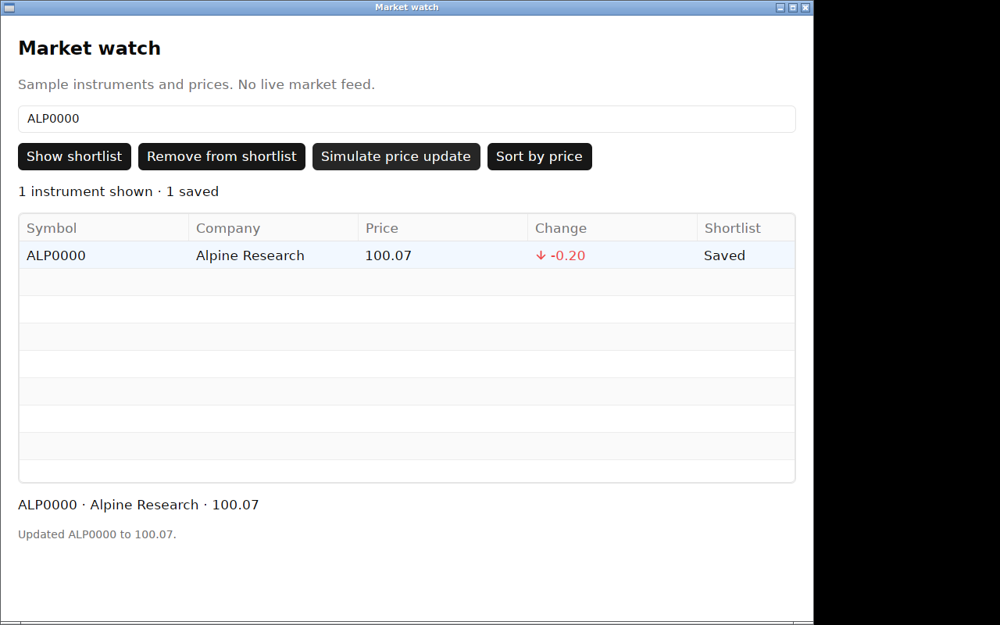
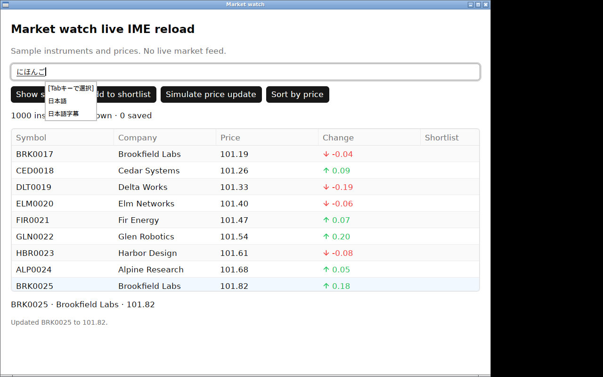

# Linux clean-VM launch and Japanese IME observation

Completed on 2026-09-26. Codex operated a fresh Ubuntu 24.04 VM and inspected
screenshots, as explicitly authorized by the owner. There was no independent
human observer. The VM ran Xorg and Openbox with a virtual display and software
Vulkan. This establishes that desktop VM's behavior; physical display and GPU
checks remain open.

The MIT AOT package passed clean-VM verification and normal application use.
Japanese composition and editing passed with **Fcitx5/Mozc configured with
`UseOnTheSpot=True`**. The default configuration failed inline preedit and
candidate placement. Both outcomes are retained. Three actual Dart code reloads
then preserved retained state, active composition, and committed Japanese
selection. No SDK runtime code changed.

## Environment and artifacts

| Item | Recorded value |
| --- | --- |
| Guest | Ubuntu 24.04 x64, kernel 6.8.0-139-generic, 2 vCPU, 4 GiB RAM |
| Virtualization | QEMU/KVM inside the existing Windows WSL2 environment; dedicated guest and container |
| Display | Xorg 21.1.12, Openbox 3.6.1, virtio virtual display, 1280 × 800, no separate compositor |
| Renderer | Mesa 25.2.8, llvmpipe/LLVM 20.1.2 software Vulkan |
| Native scale | 1.083333373; initial client 1040 × 775, resized to 900 × 720 |
| Input | US keyboard layout; ordinary XTest keys via xdotool; Romaji through Japanese Mozc |
| IME | Fcitx5 5.1.7-1build3; fcitx5-mozc 2.28.4715.102+dfsg-2.2build7 |
| AOT source | Clean `4fca3147806878bd3b8fbcff0a92676b8452727e` |
| Archive | `Watchlist-linux-x64.tar.gz`, SHA-256 `42a071c884249a188daaf16648b0336619e0ee13492f78b1c8c40ccea5823a62` |
| JIT source | `5a754c0a48888067382b5975cabbc29d50b043de`; Dart 3.13.4; temporary heading edits restored |
| Native library | Both phases used the release `libgpuidart.so` from the AOT archive |

[Environment metadata](environment.json), [cloud-image identity](image.json),
[package verification](clean-attempt2/verification.json), and
[runtime inventory](clean-attempt2/runtime-packages.txt) retain exact versions,
source/file hashes and loaded images. The cloud image's SHA-256 was checked
against Ubuntu's HTTPS checksum file before boot.

The verifier reported a 959.99994 × 715.38458 logical window at scale 1.083333373.
The desktop constrained the requested height to its available space. This is
not a 125% or physical fractional-scaling result.

## Clean launch

The initial preflight found `git` in the fresh image/package set and stopped
before executing the verifier. Git and git-man were removed only in this
disposable VM. The subsequent [tool inventory](clean-attempt2/developer-tools.txt)
shows Dart, Flutter, Rust, Cargo, GCC, Clang, Make and Git absent.

The extracted standalone verifier ran with `--runtime-only
--environment=clean_vm`, passed artifact hashes and loaded-image checks, and
completed the AOT self-test with exit code 0. Its dependency inspection came
from the archive's build-time record; it did not require build tools in the VM.
The verifier is the package's own AOT binary, not a newly installed Dart SDK.

Normal AOT launch then passed search for `ALP0000`, mouse selection, saving and
price update. The screenshot shows **100.07** and **Saved** together.

Alt+F4 closed application PID 12533. The
[process check](raw/aot-close-and-phase.json) found that PID absent and no
remaining executable from the package directory. GDB had been added after
clean verification to diagnose the window-manager problem below. The Dart SDK
and source were added only after AOT observations and closure; JIT results do
not count as clean-environment evidence.

## Observed checklist

All composition came from ordinary keys handled by the installed IME. No
Unicode injection or diagnostic text setter supplied Japanese composition.
The separate initial retained-state reload used the existing `prepare`
diagnostic to create its input selection and scroll fixture.

| Check | Result and evidence |
| --- | --- |
| Inline preedit and caret placement | Pass with the stated configuration. `nihongo` produced underlined `にほんご` in the input, with predictions below the caret. [Preedit](screenshots/aot-18-fresh-preedit.png). |
| Candidate navigation and single commit | Space opened candidates; the second candidate was `ニホンゴ`, Up selected `日本語`, and Return committed it once. [Candidates](screenshots/aot-20-candidates.png), [first candidate](screenshots/aot-21-candidate-first.png), [commit](screenshots/aot-22-commit.png). |
| Placement after a committed prefix | The popup moved right when new composition followed `日本語`. [Prefix preedit](screenshots/aot-23-prefix-preedit.png). |
| Cancel | Escape removed only the new preedit and retained `日本語`. [Cancelled](screenshots/aot-24-cancel.png). |
| Japanese selection and replacement | Shift+Left selected `語`; `go` plus Return replaced it with `ご`, producing `日本ご`. [Selection](screenshots/aot-25-selection.png), [replacement](screenshots/aot-26-replacement.png). |
| Clipboard, deletion, arrows and undo/redo | Copy/paste produced `日本語日本語`. Backspace, Left and Delete produced `日本語日`; Ctrl+Z restored the last deleted `本`, and Ctrl+Y removed it again. [Paste](screenshots/aot-29-copy-paste.png), [delete](screenshots/aot-30-delete.png), [undo](screenshots/aot-31-undo-delete.png), [redo](screenshots/aot-32-redo-delete.png). |
| Mouse and keyboard navigation | Clicking the scrolled table selected BRK0025; Down selected CED0026. [Mouse](screenshots/aot-41-select-scrolled.png), [keyboard](screenshots/aot-42-row-down.png). |
| Scroll and resize | Ten wheel notches moved the first visible row to ALP0024 while search retained focus. Resizing to 900 × 720 kept that row and the usable input/toolbar. [Scroll](screenshots/aot-39-scroll.png), [resize](screenshots/aot-40-resize.png). |
| Reload with text, selection and scroll | Pass: changed heading, identical input/table diagnostic state, selected BRK0025 and scroll −555.6922607421875 retained. [Before](screenshots/jit-sequence-2-prepared-scroll.png), [after](screenshots/jit-sequence-2-retained-after-reload.png). |
| Reload during composition | Pass: new heading with underlined preedit and popup; conversion still worked and Return committed once. [After reload](screenshots/jit-sequence-2-after-reload.png), [conversion](screenshots/jit-sequence-2-converted.png), [commit](screenshots/jit-sequence-2-committed.png). |
| Reload with Japanese selection | Pass: `日本語`, selection of `語`, focus and input entity survived another changed heading. [Before](screenshots/jit-sequence-2-selected.png), [after](screenshots/jit-sequence-2-selected-after-reload.png). |
| Physical GPU, scaling and mixed monitors | Untested. The single virtual display does not close these gates. |

## Reload assertions

[The successful record](raw/jit-sequence-2.json) retains all compared values.
Native PID 17692 and input entity 4294967298 survived. During composition,
native text stayed `にほんご`, selection stayed 12..12 in UTF-8 byte offsets,
and focus stayed true. The application query remained empty across reload and
conversion; it became `日本語` only after Return. Dataset counters remained at
one message and 151 bytes across active-composition reload. The final Japanese
selection remained 6..9. Source restoration and process exit also passed.

The screenshot immediately after typing caught an intermediate `にほんg` frame.
The subsequent pre-reload diagnostic already contained `にほんご`; the
post-reload screenshot shows that complete underlined preedit. The fixed 400 ms
capture delay is not a presentation fence. Screenshots and diagnostic calls
are separate observations, not an input-to-present measurement.

## Retained failures and diagnoses

1. **VM preparation:** the first container package fetch stalled. A bounded
   probe and build using host networking plus forced IPv4 succeeded; those two
   changes do not isolate which network condition caused the stall.
   [First build](raw/build.log), [probe](raw/apt-probe.log),
   [successful build](raw/build-host-ipv4.log). QXL was unavailable in that QEMU
   installation; [its error](raw/qxl-unavailable.stderr.log) is retained. The
   guest subsequently booted with virtio display.
2. **Clean preflight:** Git was present. [First attempt](raw/clean-verification.log),
   [original inventory](raw/developer-tools.txt), [removal](raw/remove-git.log)
   and the separate `clean-attempt2` results preserve the sequence.
3. **Default XIM behavior:** without `UseOnTheSpot=True`, preedit stayed outside
   the field and predictions appeared near the window's bottom-left corner.
   [Failed placement](screenshots/aot-04-preedit.png),
   [configuration change](raw/xim-configuration-change.json). The pinned GPUI
   X11 backend requests `PREEDIT_CALLBACKS`. Fcitx 5.1.7 advertises that style
   only when this option is enabled; otherwise its code falls back to the root
   style. See [Fcitx's option definition](https://github.com/fcitx/fcitx5/blob/5.1.7/src/frontend/xim/xim.h)
   and [style negotiation](https://github.com/fcitx/fcitx5/blob/5.1.7/src/frontend/xim/xim.cpp).
4. **IME replacement stalled the window manager:** replacing Fcitx in the live
   session left new app windows unmapped, including a control with IME disabled.
   The apps were still alive; the process name was `dart:Watchlist`, so an early
   `ps -C Watchlist` probe missed them. [Process records](raw/configured-unmapped-processes.json),
   [control](raw/no-ime-startup.json), [native stack](raw/startup-backtrace.log)
   and [Openbox stack](raw/openbox-backtrace.log) localize the observed wait:
   Openbox was inside `XDestroyIC`, called by keyboard shutdown/reload, while
   GPUI's UI thread was polling its event loop. Restarting only the isolated
   guest desktop with the configuration already in place restored mapping and
   IME behavior. Windows and the VM were not restarted. The first service kill
   reported an error after stopping the service; an intervening launch without
   a display failed. [Restart record](raw/desktop-restart.json) and
   [failed launch](raw/aot-11-session-open.stderr.log) are retained.
5. **Redo shortcut:** Ctrl+Shift+Z did nothing. The pinned Linux keymap uses
   Ctrl+Y; the later undo/redo sequence passed with that shortcut.
6. **JIT setup:** a quoting error stopped the first SDK-transfer driver before
   guest changes. [Failure](raw/development-phase.log),
   [corrected attempt](raw/development-phase-attempt2.log). The first reload
   sequence then stopped before app launch because the harness had no launcher
   path. [Failed record](raw/jit-sequence-1.json). Setting both
   `GPUIDART_LIBRARY` and `GPUIDART_LAUNCHER` to the extracted package produced
   the successful second sequence. A later host-side JSON inspection initially
   used the Windows default encoding; explicitly reading UTF-8 corrected that
   inspection without changing the saved record.

## Reproduction and scope

[Drivers](drivers/) retain the executed provisioning, input, capture, process
diagnosis and reload scripts as text. They are session evidence, not SDK APIs.
The private SSH key, cloud-init seed and guest disks are not committed.
[The manifest](capture-manifest.json) hashes 46 screenshots and their
foreground/PID/input metadata. The driver targeted only the owned guest app.
[The evidence audit](evidence-audit.json) checks those hashes, archive contents,
source identity, local links and saved assertions. After capture,
[cleanup](raw/cleanup.json) confirmed no application or Dart processes remained
and shut down the test VM; its dedicated container was then stopped. Other
containers, WSL and the Windows desktop were left running.

Configure Fcitx's XIM frontend before starting the desktop session, use
`XMODIFIERS=@im=fcitx`, and start the packaged app in X11. To repeat JIT from the
recorded source, copy `reload_sequence.dart.txt` to `tool/observe_ime.dart`, set
the two package paths in `run_jit.sh.txt`, and choose a fresh sequence name.
The recorder rejects existing evidence filenames.

This closes clean Linux VM launch and the configured Japanese XIM observation
for this fixture by the owner's authorized agent method. Default Fcitx setup,
other IMEs, IBus, native Wayland, physical devices, macOS and presentation
latency are not established. macOS signing and the original unlocalized Windows
reload incident remain separate release gates.
