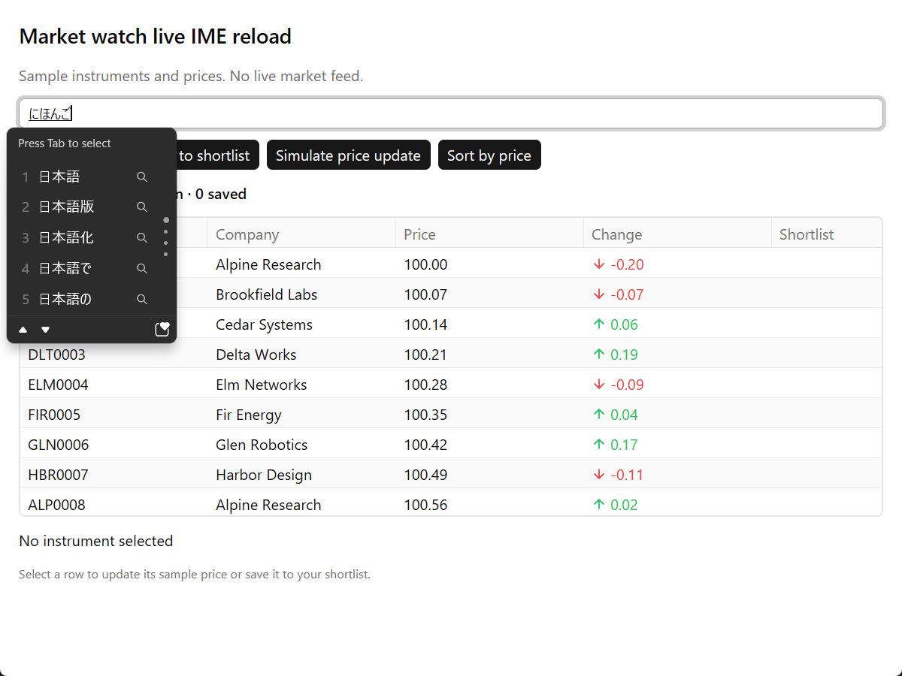

# Windows Japanese IME observation

Completed on 2026-09-26 using Microsoft Japanese IME on the physical Windows
desktop. The owner explicitly requested screenshot or other-tool verification.
Codex operated the application and inspected the screenshots. This closes the
Windows Japanese IME observation step by that authorized method. There was no
independent human observer.

The AOT package passed the composition and editing checks. JIT development also
preserved active composition across an actual Dart code reload, followed by
conversion and commit. A second reload preserved committed text and selection.
No SDK runtime change was needed.

## Environment and artifact

| Item | Observed value |
| --- | --- |
| OS | Windows 11 Pro 25H2, build 26200.9457, x64 |
| Display | One 1920 × 1200 display, DPI 120, 125% scale |
| Input method | Microsoft Japanese IME, Hiragana with Romaji key input, layout `0x04110411` |
| IME binary | `imjptip.dll` version `10.0.26100.9278 (WinBuild.160101.0800)` |
| AOT package | `WatchlistMit4fca314-windows-x64.zip`, clean source `4fca3147806878bd3b8fbcff0a92676b8452727e` |
| JIT source | Clean `a8bc4ca6f31d81cd3b9090c9766b2d903717a6d3`, with temporary heading edits restored after reload |
| Native library for both | Release `gpuidart.dll` from that AOT package |
| ZIP SHA-256 | `e5b66c8b3dfafc5af04bd85f56f572acc5bf69a41e2c50b6f823def67476d87b` |
| DLL SHA-256 | `b0d6e99d66ebd6fd507afcfd1e90a4dd345176306c0b60b00f431c630ad06770` |

[Environment metadata](environment.json) records tool versions and source identity.
[The manifest](capture-manifest.json) gives SHA-256 hashes and UTC timestamps for
36 retained screenshots. Matching [capture metadata](captures/) records the target
PID, window bounds, keyboard layout and foreground status.
[The evidence audit](evidence-audit.json) checks hashes, local document links,
saved reload/resize assertions and unchanged SDK source.

## Observed checklist

The step numbers refer to [Windows release checks](../../../docs/windows-release-checks.md#human-input-and-ime-composition).
All text below was entered through ordinary virtual-key events handled by the
installed IME. No Unicode character injection or diagnostic text setter supplied
the composition.

| Step | Result | Observation and evidence |
| --- | --- | --- |
| 1. Marked preedit | Pass | Typing `nihongo` produced underlined `にほんご` and a visible IME prediction window. [Preedit](screenshots/aot-05-preedit.png). |
| 1. Candidate placement | Pass at this scale | The popup appeared below the composing text and moved right when composition began after the committed prefix `日本語`. [Initial placement](screenshots/aot-05-preedit.png), [placement after a prefix](screenshots/aot-10-prefix-preedit.png). |
| 2. Candidate navigation and commit | Pass | Space opened conversion candidates, Up selected `日本語`, and Enter committed it exactly once. The input had no residual underline and the table showed zero matches. [Candidates](screenshots/aot-07-candidates.png), [selected candidate](screenshots/aot-08-candidate-selected.png), [commit](screenshots/aot-09-committed.png). |
| 3. Cancel | Pass | A second composition after `日本語` was removed with Escape. The committed prefix remained unchanged. [Before](screenshots/aot-10-prefix-preedit.png), [after](screenshots/aot-11-cancelled.png). |
| 4. Partial selection and replacement | Pass | Shift+Left selected `語`; IME input replaced it with `ご`, producing `日本ご`. [Selection](screenshots/aot-12-selection.png), [replacement preedit](screenshots/aot-13-replacement-preedit.png), [commit](screenshots/aot-14-replaced.png). |
| 4. Editing and clipboard | Pass | Ctrl+Z restored `日本語`, Ctrl+Y restored `日本ご`, and copy/paste produced `日本ご日本ご`. Backspace produced `日本ご日本`; Home, Delete and Right produced `本ご日本` with the moved caret. [Undo](screenshots/aot-15-undo.png), [redo](screenshots/aot-16-redo.png), [paste](screenshots/aot-17-copy-paste.png), [Backspace](screenshots/aot-18-backspace.png), [Delete and arrow](screenshots/aot-19-delete-arrow.png). |
| 5. Reload with committed text and selection | Pass | A changed Dart heading appeared while `日本語`, selection of `語`, focus and native input identity remained unchanged. [Before](screenshots/jit-sequence-1-selected.png), [after](screenshots/jit-sequence-1-selected-after-reload.png), [state assertions](jit-sequence-1.json). |
| 5. Reload during active composition | Pass | The heading changed while `にほんご` remained underlined with the IME popup visible. Space still converted to `日本語`, and Enter committed it exactly once. The application query stayed empty until Enter. [Before](screenshots/jit-sequence-1-preedit.png), [after reload](screenshots/jit-sequence-1-after-reload.png), [conversion](screenshots/jit-sequence-1-converted.png), [commit](screenshots/jit-sequence-1-committed.png). |
| 6. Selection and toolbar actions | Pass, with interrupted capture retained below | Clearing restored 1,000 rows. Mouse selection chose ALP0000; Down selected BRK0001. Saving, price update and shortlist toggling worked. The price advanced from 100.07 to 100.14 with selection retained. Sort cycled through descending, ascending and source order; adding/removing a saved row updated the count. [Mouse](screenshots/aot-21-row-selected.png), [keyboard result after focus recovery](screenshots/aot-23-row-after-focus-return.png), [saved](screenshots/aot-24-shortlisted.png), [price](screenshots/aot-25-price-update.png), [shortlist](screenshots/aot-28-show-shortlist.png), [all rows](screenshots/aot-29-show-all.png), [descending](screenshots/aot-extra-03-sort-desc.png), [ascending](screenshots/aot-extra-04-sort-asc.png), [source order](screenshots/aot-extra-05-sort-source.png), [add](screenshots/aot-extra-09-add.png), [remove](screenshots/aot-extra-10-remove.png). |
| 6. Scrolling and resize | Pass at the tested sizes, with an unattributed transition retained below | Vertical wheel input moved the viewport while the selected record remained in the footer. Resizing the outer window to 1050 × 840 left input and toolbar usable. The table scrolled horizontally to expose its rightmost column. [Vertical scroll](screenshots/aot-26-scroll.png), [resize](screenshots/aot-27-resize.png), [horizontal scroll](screenshots/aot-extra-07-horizontal.png), [controlled resize assertions](resize-sequence.json). |

## Actual reload evidence

The decisive sequence in [jit-sequence-1.json](jit-sequence-1.json) performed two
VM code reloads. The first changed the heading to `Market watch live IME reload`.
The same native process, PID 9384, and input entity 4294967298 survived. Native
text remained `にほんご`, selection remained 12..12 in UTF-8 byte offsets, and
focus stayed true. The application query remained empty, so reload had not
committed the composition. Dataset message and byte counters did not advance.

Space then converted the still-active composition, with the application query
still empty. Enter changed both native text and the application query to
`日本語`. After selecting the last character, the second reload changed the
heading to `Market watch committed IME reload` and preserved the entire input
diagnostic state. The screenshots also show the new heading and highlight.

## Method and reproduction

The computer-use helper could not connect to its native pipe. The fallback used
Python 3.14.2, Pillow 12.2.0 and pywin32 311. Win32 `SendInput` supplied ordinary
key events; Pillow captured the target client area. The driver checked foreground
ownership before input and capture. Later checks also rejected occluded client
corners. Only the owned test windows were targeted.

The driver selected the already-installed Japanese layout with
[WM_INPUTLANGCHANGEREQUEST](https://learn.microsoft.com/en-us/windows/win32/winmsg/wm-inputlangchangerequest)
and used Ctrl+CapsLock for Hiragana. Microsoft's
[Japanese IME guide](https://support.microsoft.com/en-us/windows/hardware/input-devices/microsoft-japanese-ime)
documents the input modes and keyboard operations.

The executed reload/resize sequences and final desktop driver are retained as
text under [drivers/](drivers/). They are session evidence, not SDK entry points.
To reproduce the reload sequence from the
recorded source with Japanese IME installed:

1. Use an unlocked desktop at the recorded scale. Leave keyboard and mouse input
   idle while the sequence runs; foreground interference invalidates a capture.
2. Copy `desktop.py.txt` and `reload_sequence.dart.txt` into
   `.cache/ime-observation/`, removing the final `.txt` suffix. Put Python with
   the recorded dependencies on PATH.
3. Set `GPUIDART_LIBRARY` to the absolute path of the recorded release DLL.
4. Run `dart run .cache/ime-observation/reload_sequence.dart jit-sequence-2`, using
   a fresh numeric suffix for every attempt. The runner refuses to overwrite an
   existing report. It temporarily edits `example/watchlist/app.dart`, reloads
   through the existing VM-service controller, and restores the original bytes
   in `finally`.
5. Inspect every resulting screenshot and the JSON assertions. A JSON pass alone
   does not establish visible preedit or correct candidate placement.

`resize_sequence.dart.txt` records the separate sort/resize follow-up. Its fixed
click coordinates apply to the recorded display and example layout. The AOT
steps were driven individually with `desktop.py`; the checklist records their
keys and resulting screenshots. All test windows were closed after observation,
the target input layout was restored to English, and temporary topmost settings
were removed. Application source was restored byte-for-byte.

## Interrupted attempts and unresolved observations

- The native helper failed with `Computer Use native pipe is unavailable` and
  Windows error 2. No helper-based visual pass was inferred.
- Foreground activation sometimes failed or another window became active between
  operations. `aot-22-row-keyboard` captured the wrong foreground; its
  [metadata](interrupted/aot-22-row-keyboard.json) is retained. The subsequent
  [recovered capture](screenshots/aot-23-row-after-focus-return.png) shows the
  selected BRK0001 result. It does not establish uninterrupted focus ownership.
- Interactive JIT attempts were too spread out to protect composition from
  shared-desktop activity. [Before](interrupted/jit-composition-before.json) and
  [after](interrupted/jit-composition-after.json) states differ, but the accompanying
  capture showed another application. A later attempt had displaced window
  geometry and incorrect initial preedit. Their JSON is in [interrupted/](interrupted/).
  These are inconclusive observations. Screenshots containing other applications
  are excluded from the published evidence. The short, controlled
  `jit-sequence-1` completed with valid foreground captures and all assertions.
- The extra AOT sequence showed source order in
  [aot-extra-05](screenshots/aot-extra-05-sort-source.png), then a descending-sort
  label in [aot-extra-06](screenshots/aot-extra-06-narrow.png) after resizing.
  This extra transition is unattributed. The controlled follow-up in
  [resize-sequence.json](resize-sequence.json) recorded exactly three callbacks
  for three clicks, then no callback or view change on resize. That pass does
  not establish the cause of the earlier transition.

## Scope

This verifies the tested Microsoft Japanese IME path, package and JIT reload on
one Windows display at 125%. Other IMEs, AltGr, mixed-monitor movement and macOS
or Linux input backends remain unverified. No presentation timing or performance
claim follows from these observations. The original Windows reload mismatch in
`attempt-023eef4` remains unlocalized. See the
[remaining release gates](../../release/README.md#gates-still-open).
